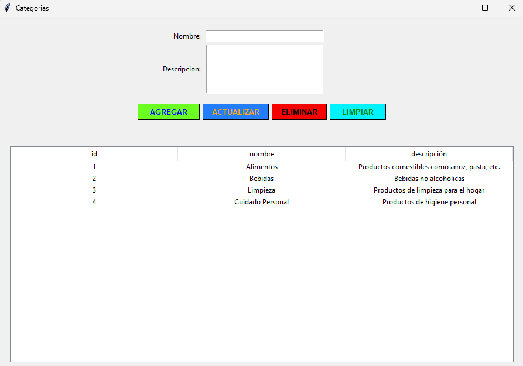
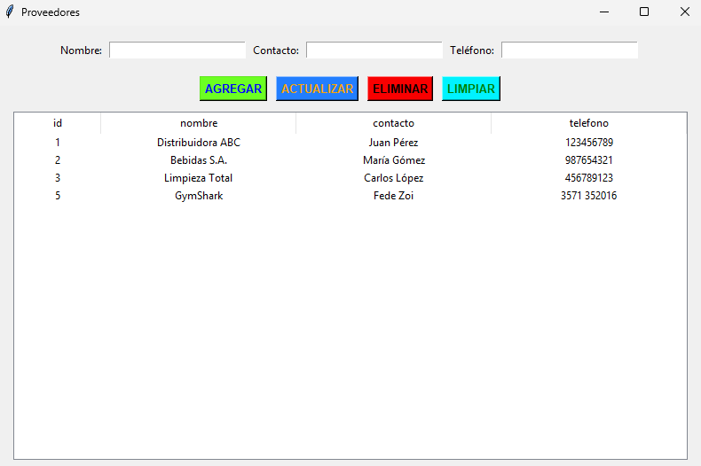

# Minimarket FullStack B

**Una app de gestión de minimarket con Python + MySQL + Tkinter**

---

## Descripción

Una aplicación de escritorio que permite:
- Login con roles (admin/empleado/super_usuario)
- Gestio de productos, categorias, proveedores y usuarios(empleados) (Agregar/Leer/Actualizar/Eliminar)
- Registrar movimientos de entrada y salida
- Reportes sobre el stock actual y los movimientos del dia
- Conexión a base de datos MySQL mediante XAMPP

---

## Tecnologías

- Python 3.13.9
- Tkinter (Interfaz Gráfica)
- MySQL (XAMPP)

---

## Estructura del proyecto

MINIMARKET_FULLSTACK_B_APP
|    L Capturas
|        L Confirmacion_Login.png
|        L Pantalla_AdministrarUsuarios.png
|        L Pantalla_Categorias.png
|        L Pantalla_Login.png
|        L Pantalla_Menu.png
|        L Pantalla_Movimientos.png
|        L Pantalla_Productos.png
|        L Pantalla_Proveedores.png
|        L Pantalla_Reportes.png
|    L Database
|        L db_connection.py
|    L Modules
|        L __init__.py
|        L AdminUser.py
|        L Categories.py
|        L Login.py
|        L Menu.py
|        L Movements.py
|        L Products.py
|        L Reports.py
|        L Suppliers.py
|    L main.exe
|    L Main.py
|    L main.spec
|    L Readme.md <--- Este archivo

---

## Requisitos previos

1. Windows 10 o superior
2. Python 3.13.9 o superior
3. XAMPP con conexion a MySQL

---

## Instalación

1. **Clonar o descargar el proyecto**
    a. Entra al link: https://github.com/Fabricio-Romero/Aplicacion_FullStack.git
    b. Presione el boton ubicado arriba a la derecha donde dice <>Code y luego seleccione download zip
    c. Extraiga el archivo

2. **Instalar XAMPP**:
    Ingrese al link: https://www.apachefriends.org/es/index.html
    Y presione XAMPP para Windows
    Una vez instalado presione el boton "start" en apache y MySQL
    Luego presione el boton "admin" en MySQL

3. **Crear la base de datos en XAMPP**
    Se va a abrir una página, en esa pagina dirigase al apartado que dice SQL, luego en ese apartado copia y pega el siguente script:
    
    CREATE DATABASE IF NOT EXISTS Minimarket_FullStack_B;
    USE Minimarket_FullStack_B;

    CREATE TABLE categorias (
        id INT AUTO_INCREMENT PRIMARY KEY,
        nombre VARCHAR(50) NOT NULL,
        descripcion TEXT
    );

    CREATE TABLE proveedores (
        id INT AUTO_INCREMENT PRIMARY KEY,
        nombre VARCHAR(100) NOT NULL,
        contacto VARCHAR(100),
        telefono VARCHAR(20)
    );

    CREATE TABLE usuarios (
        id INT AUTO_INCREMENT PRIMARY KEY,
        nombre VARCHAR(100) NOT NULL,
        email VARCHAR(100) NOT NULL UNIQUE,
        rol ENUM('admin', 'empleado', 'super_usuario') DEFAULT 'empleado'
    );

    CREATE TABLE productos (
        id INT AUTO_INCREMENT PRIMARY KEY,
        nombre VARCHAR(100) NOT NULL,
        precio DECIMAL(10, 2) NOT NULL,
        cantidad INT NOT NULL,
        categoria_id INT,
        proveedor_id INT,
        FOREIGN KEY (categoria_id) REFERENCES categorias(id) ON DELETE SET NULL,
        FOREIGN KEY (proveedor_id) REFERENCES proveedores(id) ON DELETE SET NULL
    );

    CREATE TABLE movimientos_inventario (
        id INT AUTO_INCREMENT PRIMARY KEY,
        producto_id INT,
        tipo ENUM('entrada', 'salida') NOT NULL,
        cantidad INT NOT NULL,
        fecha DATETIME DEFAULT CURRENT_TIMESTAMP,
        usuario_id INT,
        FOREIGN KEY (producto_id) REFERENCES productos(id) ON DELETE CASCADE,
        FOREIGN KEY (usuario_id) REFERENCES usuarios(id) ON DELETE SET NULL
    );

    INSERT INTO usuarios (nombre, email, rol) VALUES
    ('Romero Fabricio', 'Fabricio@minimarket.com', 'super_usuario');

4. **Paso Final**
    Una vez pegado el script, en la parte inferior derecha en el apartado SQL hay un boton que dice "Continuar", presionelo y listo!

---    

## Como ejecutar

Haga doble click en el archivo main.exe, luego le va a salir un cartel de advertencia de windows, presione en mas información y luego en ejecutar de todas maneras y a disfrutar!

---

## Capturas de pantalla

**Login**

**Menú**

**Productos**

**Movimientos**

**Reportes**

**Categorias**

**Proveedores**

**Administrar Usuarios**

---

## Autores

Romero Fabricio - Desarrollador Principal
Clase de Programación FullStack B - 2025