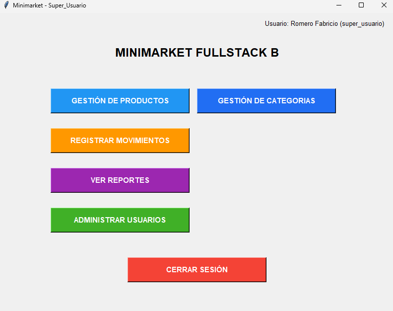
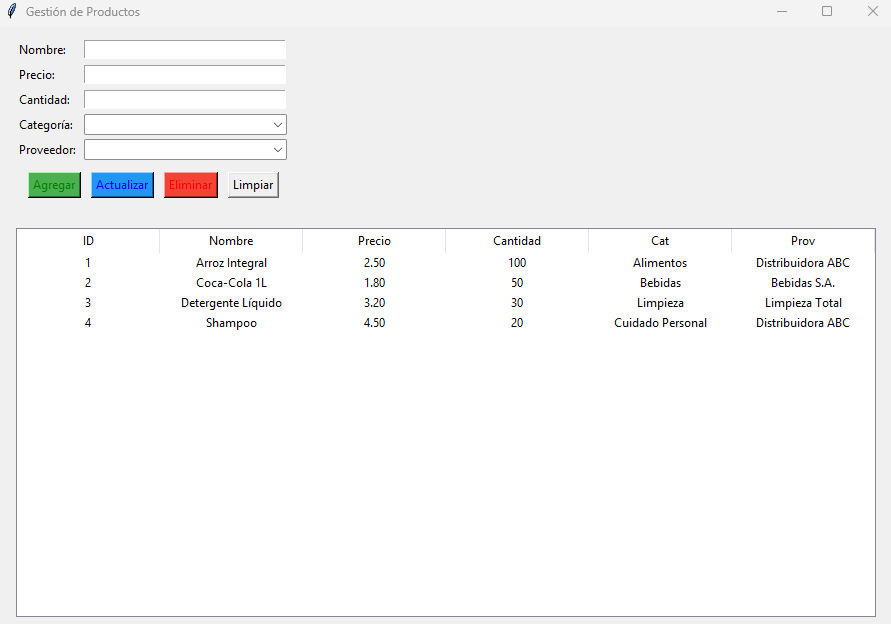
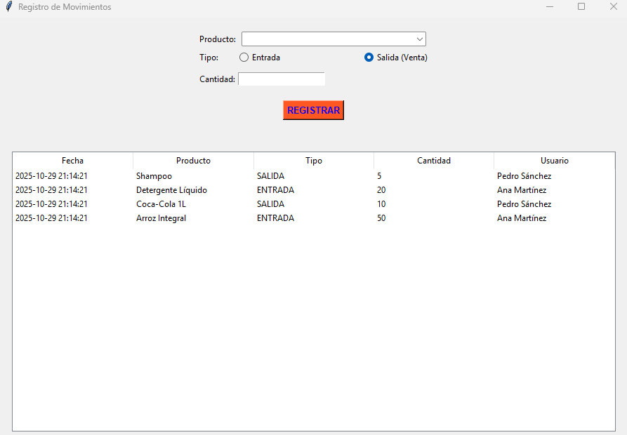
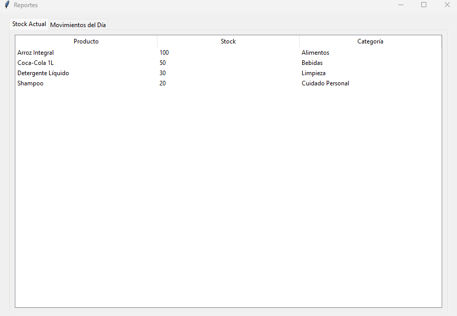
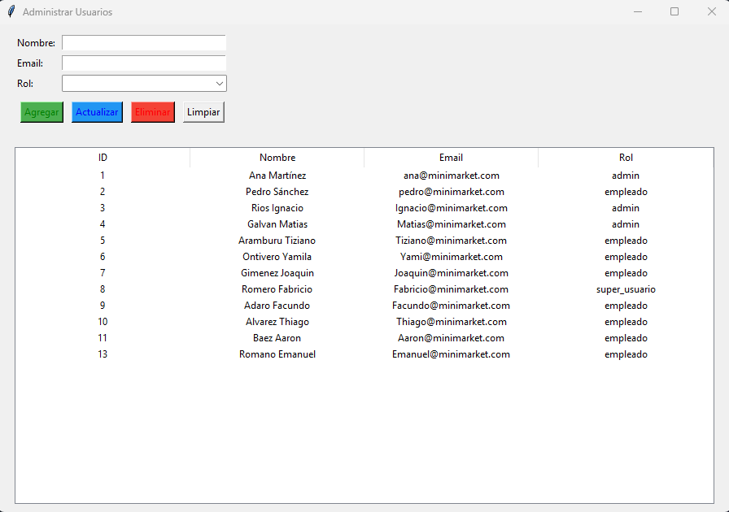

# Minimarket FullStack B

**Una app de gestión de minimarket con Python + MySQL + Tkinter**

---

## Descripción

Una aplicación de escritorio que permite:
- Login con roles (admin/empleado/super_usuario)
- Gestio de productos (Agregar/Leer/Actualizar/Eliminar)
- Conexión a base de datos MySQL

---

## Tecnologías

- Python 3.13.9
- Tkinter (Interfaz Gráfica)
- MySQL
- mysql-connector-python

---

## Estructura del proyecto

MINIMARKET_FULLSTACK_B_APP
|    L Assets
|    L Capturas
|    L Database
|    |    L db_connection.py
|    L Modules
|    |    L __init__.py
|    |    L AdminUser.py
|    |    L Login.py
|    |    L Menu.py
|    |    L Movements.py
|    |    L Products.py
|    |    L Reports.py
|    L Main.py
|    L Readme.md <--- Este archivo

---

## Requisitos previos

1. Python 3.13.9+
2. MySQL (XAMPP o MySQL Server)
3. Visual Studio Code

---

## Instalación

1. **Clonar o descargar el proyecto**
    a. Entra al link: https://github.com/Fabricio-Romero/Aplicacion_FullStack.git
    b. Presione el boton ariiba a la derecha donde dice <>Code y luego seleccione download zip
    c. Extraiga el archivo

2. **Instalar el conector de MySQL a Python**:
    En la terminal del Visual Studio Code ejecute:
    pip install mysql-connector-python
3. **Crear la base de datos en MySQL Workbench**
    Ejecute el siguiente script en MySQL Workbench:
    
    CREATE DATABASE IF NOT EXISTS Minimarket_FullStack_B;
    USE Minimarket_FullStack_B;

    CREATE TABLE categorias (
        id INT AUTO_INCREMENT PRIMARY KEY,
        nombre VARCHAR(50) NOT NULL,
        descripcion TEXT
    );

    CREATE TABLE proveedores (
        id INT AUTO_INCREMENT PRIMARY KEY,
        nombre VARCHAR(100) NOT NULL,
        contacto VARCHAR(100),
        telefono VARCHAR(20)
    );

    CREATE TABLE usuarios (
        id INT AUTO_INCREMENT PRIMARY KEY,
        nombre VARCHAR(100) NOT NULL,
        email VARCHAR(100) NOT NULL UNIQUE,
        rol ENUM('admin', 'empleado', 'super_usuario') DEFAULT 'empleado'
    );

    CREATE TABLE productos (
        id INT AUTO_INCREMENT PRIMARY KEY,
        nombre VARCHAR(100) NOT NULL,
        precio DECIMAL(10, 2) NOT NULL,
        cantidad INT NOT NULL,
        categoria_id INT,
        proveedor_id INT,
        FOREIGN KEY (categoria_id) REFERENCES categorias(id) ON DELETE SET NULL,
        FOREIGN KEY (proveedor_id) REFERENCES proveedores(id) ON DELETE SET NULL
    );

    CREATE TABLE movimientos_inventario (
        id INT AUTO_INCREMENT PRIMARY KEY,
        producto_id INT,
        tipo ENUM('entrada', 'salida') NOT NULL,
        cantidad INT NOT NULL,
        fecha DATETIME DEFAULT CURRENT_TIMESTAMP,
        usuario_id INT,
        FOREIGN KEY (producto_id) REFERENCES productos(id) ON DELETE CASCADE,
        FOREIGN KEY (usuario_id) REFERENCES usuarios(id) ON DELETE SET NULL
    );

    INSERT INTO usuarios (nombre, email, rol) VALUES
    ('Romero Fabricio', 'Fabricio@minimarket.com', 'super_usuario');

---    

## Como ejecutar

1. Abre la terminal en la carpeta del proyecto
2. Ejecuta: python main.py
3. Inicia sesión con:
    - Email: Fabricio@minimarket.com
    - Rol: super_usuario

---

## Capturas de pantalla

**Login**

**Menú**

**Productos**

**Movimientos**

**Reportes**

**Administrar Usuarios**

---

## Autores

Romero Fabricio - Desarrollador Principal
Clase de Programación FullStack B - 2025